# Registration Process for Armed Forces Course

## Description

This project handles the registration process for candidates applying to a course offered by the Armed Forces. The system allows users to register their personal details, which are reviewed by an administrator. Upon acceptance, the user is required to upload a PDF document (typically a grade or identification document) using a unique URL sent via email. The administrator reviews the uploaded document and decides whether to accept or reject the application. All communication, including registration confirmation and document submission status, is done via email.

The project is split into two main parts:

- **Backend**: Handles data storage, email notifications, document management, and communication between the frontend and the database.
- **Frontend**: Provides the user interface for candidates to register, view their status, and upload documents. Administrators can also manage registrations and review documents.

## Registration Process

1. **User Registration**: 
   - A candidate registers on the platform by filling out their details, including personal information like identification number, phone number, email, and other relevant data.
   
2. **Admin Review**: 
   - After submitting the registration, the admin receives the registration details for review. The admin can accept or reject the user's registration.

3. **Document Upload**:
   - If the registration is accepted, the candidate will receive an email containing a unique URL to upload the required PDF document (such as a grade certificate). This document is uploaded directly to the platform through the provided link.

4. **Document Review**:
   - The admin reviews the uploaded document and either approves or rejects it based on the criteria. The result is communicated to the user via email, and the status is updated in the system.

5. **Email Notifications**:
   - The system sends various email notifications at each step of the process, including registration acceptance, document submission, and document approval or rejection.

## Technologies

### Backend
- **Node.js**: Runtime environment for server-side applications.
- **Express.js**: Web framework for building the API.
- **MongoDB**: NoSQL database for storing registration and document data.
- **Multer**: Middleware for handling file uploads.
- **Nodemailer**: For sending emails related to registration and document submission.
- **dotenv**: To manage environment variables securely.

### Frontend
- **Angular**: Framework for building the single-page application.
- **RxJS**: For handling asynchronous events and observables.
- **PrimeNG**: UI component library for building responsive and dynamic user interfaces.
- **Bootstrap**: CSS framework for responsive and mobile-first web development.
- **Ngx-Translate**: For handling localization and internationalization.

## Results

### User Registration Form

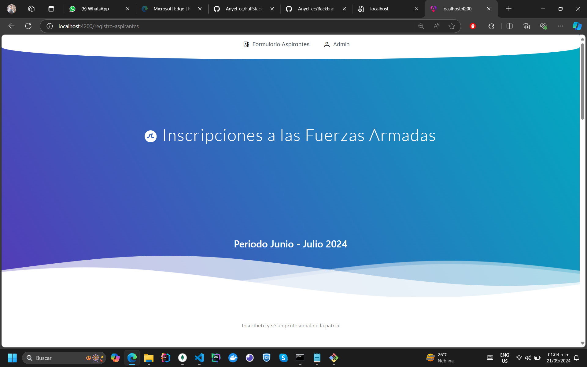
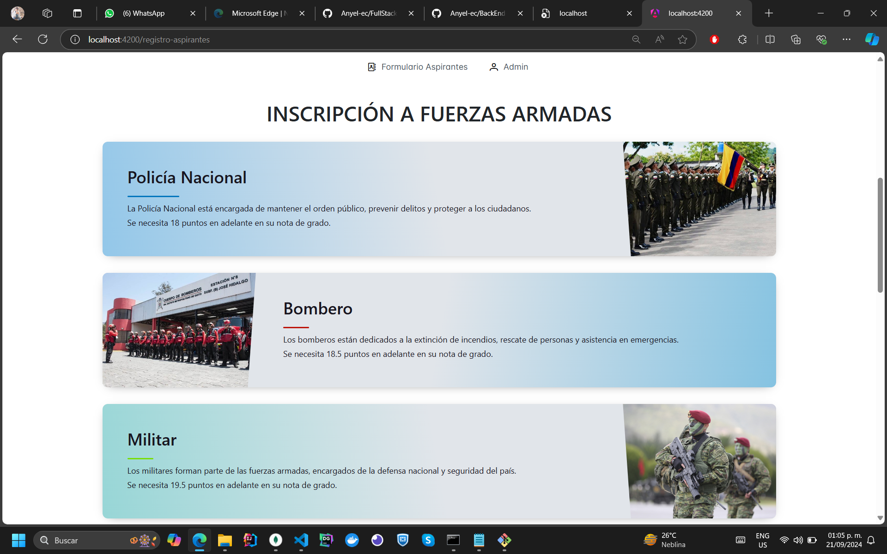
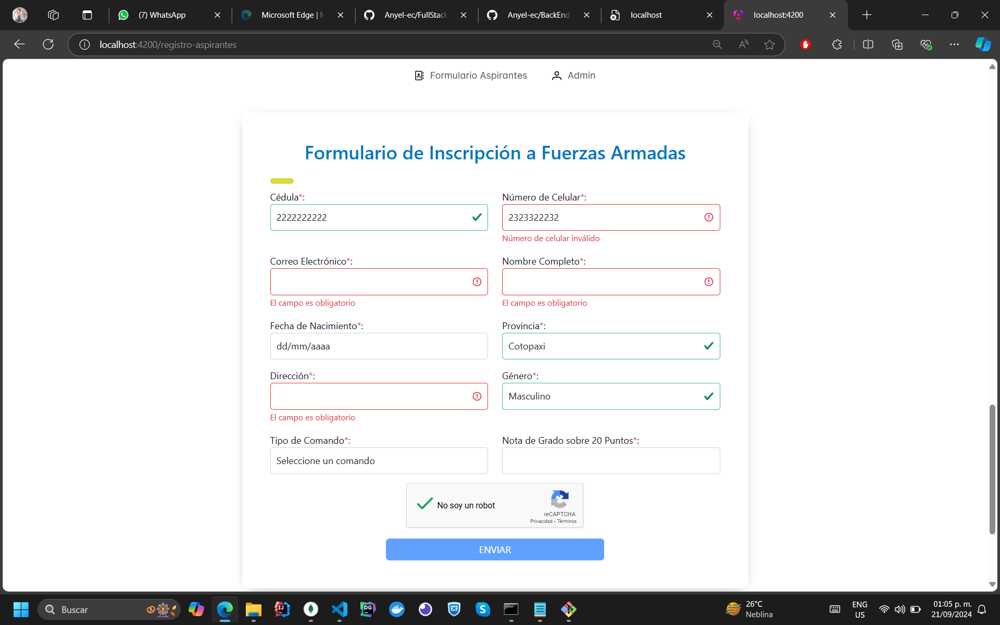

### Admin Dashboard for Reviewing Registrations

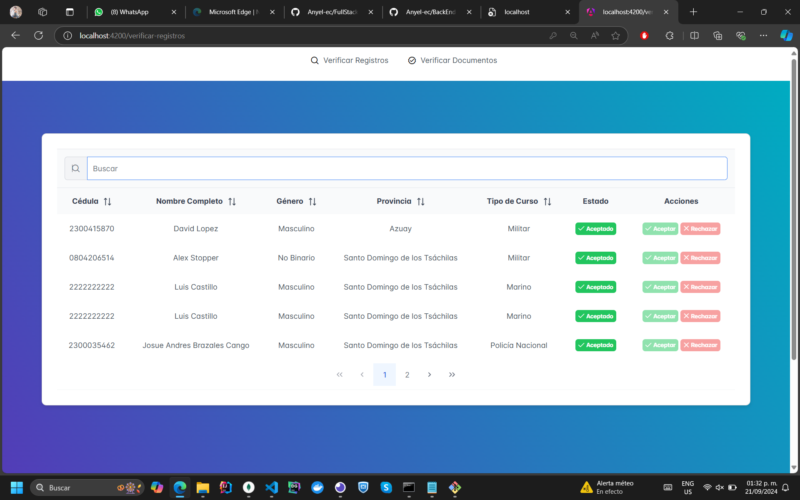
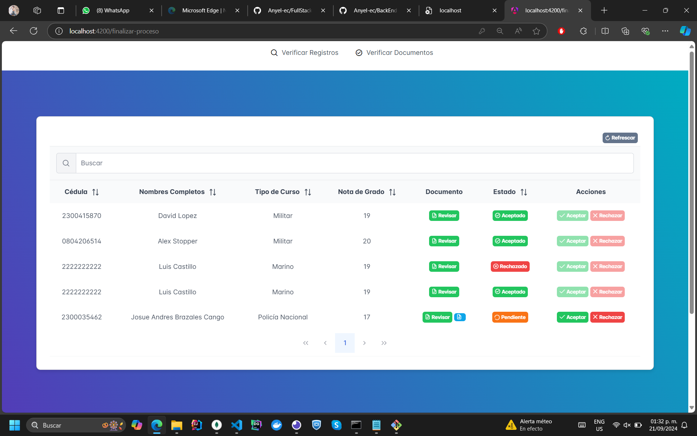

### Document Upload Page

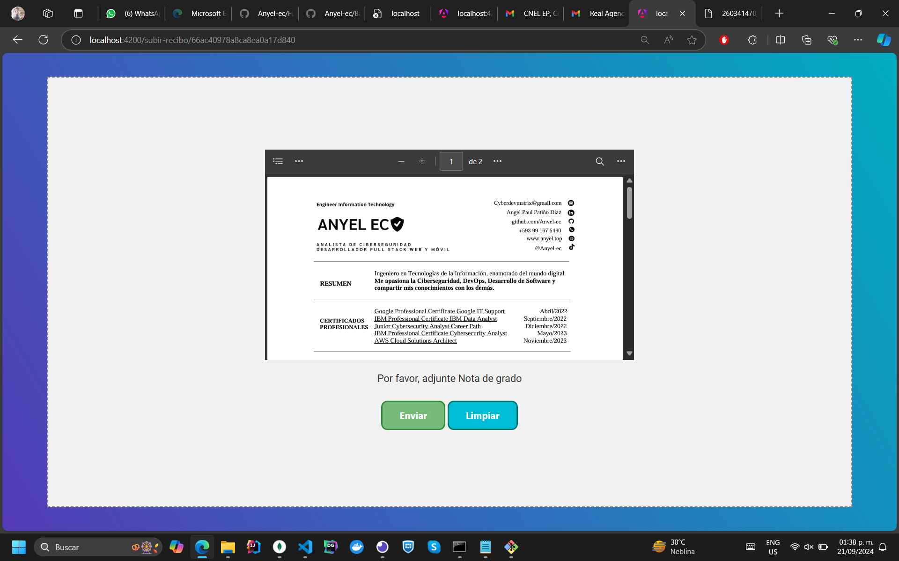

### Email Example with Upload URL

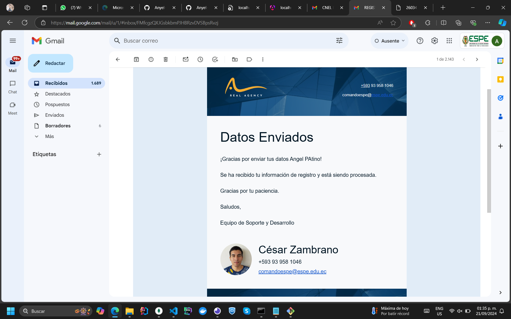
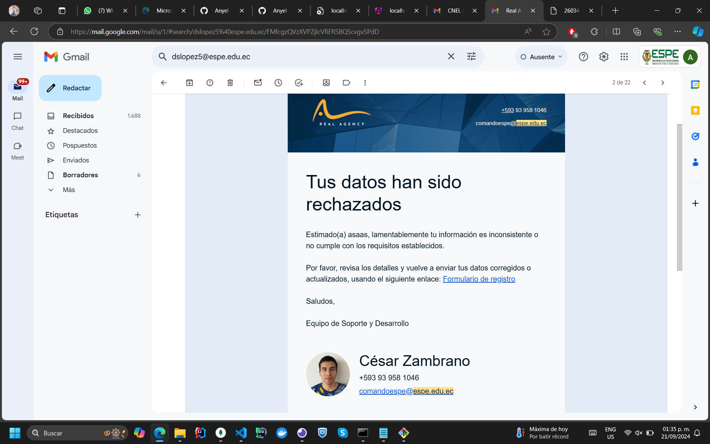
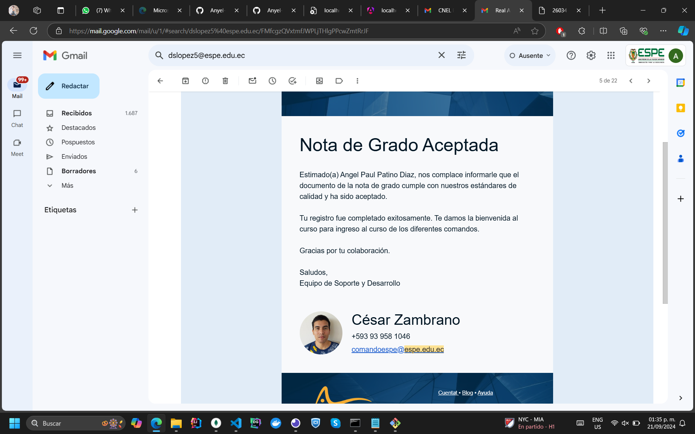
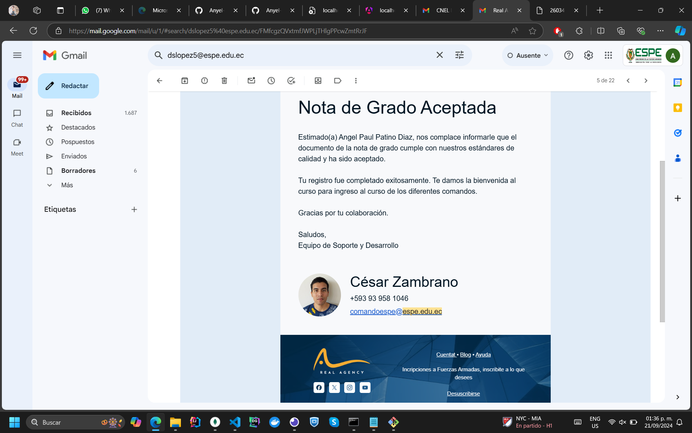

### Document Review Process

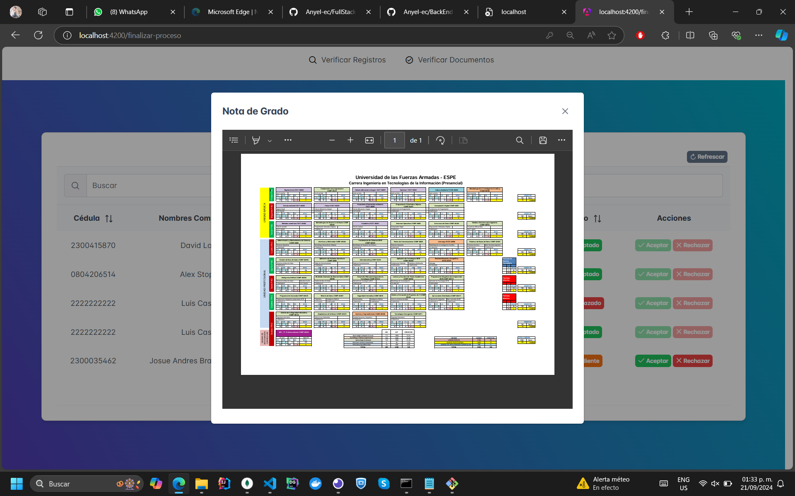

### Microservices - NodeJS

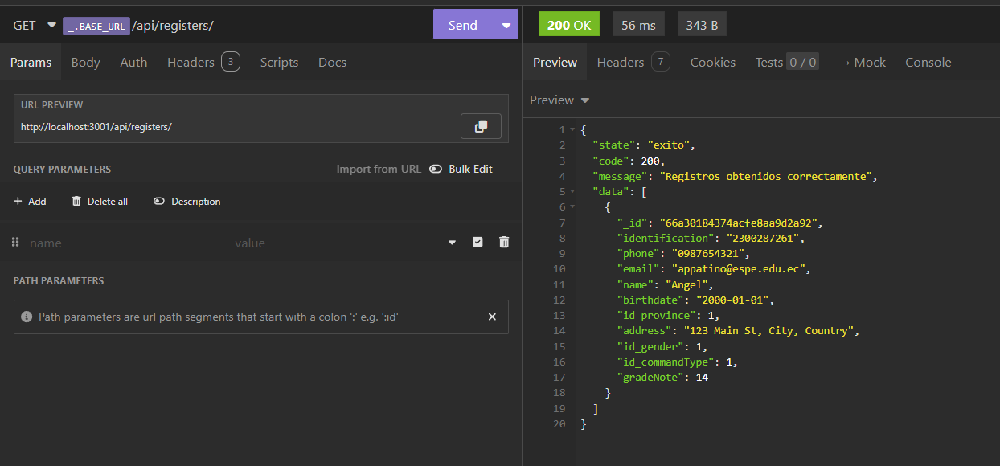
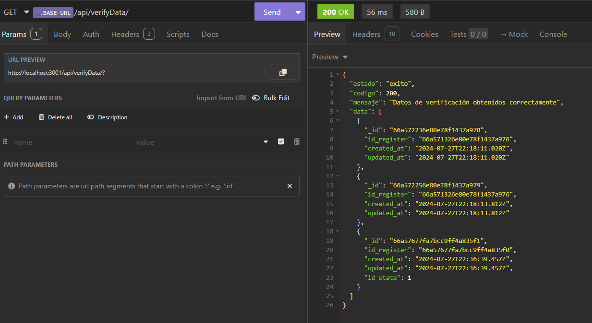
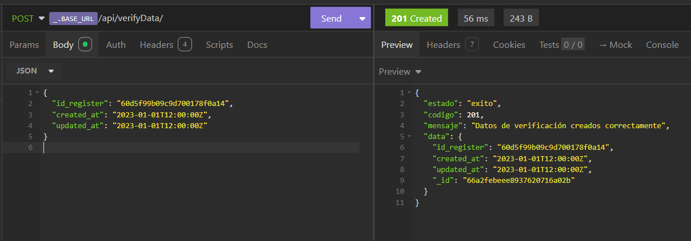

### MongoDB Atlas


## Key Features

- **Registration System**: Users can register for the course by submitting their personal information through a registration form.
- **Admin Review**: The admin can accept or reject registrations, with automatic email notifications sent to users.
- **Document Upload**: After registration approval, users receive an email with a link to upload required documents (PDF format).
- **Document Review**: Admins review the uploaded documents and decide whether to approve or reject the application.
- **Email Notifications**: Notifications are sent via email at each step of the process to keep users informed of their application status.
- **Responsive Design**: The frontend is built with responsive design to ensure usability on both desktop and mobile devices.

## How to Run the Project

### Backend

1. Clone the repository:

    ```bash
    git clone https://github.com/Anyel-ec/FullStack-ProcesoRegistroCursoFuerzasArmadas-NodeJS-Angular18-MongoDB
    ```

2. Install dependencies:

    ```bash
    cd backend 
    npm install
    ```

3. Create a `.env` file with the following variables:

    ```env
    PORT=3001
    MONGODB_URI=mongodb://localhost:27017/your_db
    EMAIL_USER=your_email@example.com
    EMAIL_PASS=your_password
    ```

4. Start the backend server:

    ```bash
    npm start
    ```

### Frontend

1. Clone the repository:

    ```bash
    git clone https://github.com/Anyel-ec/FullStack-ProcesoRegistroCursoFuerzasArmadas-NodeJS-Angular18-MongoDB

    ```

2. Install dependencies:

    ```bash
    cd FullStack-ProcesoRegistroCursoFuerzasArmadas-NodeJS-Angular18-MongoDB
    npm install
    ```

3. Run the frontend application:

    ```bash
    ng serve
    ```

The frontend will run at `http://localhost:4200`.

## Author

Developed by **Angel Patiño**.
